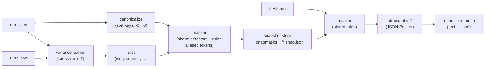

# snapmask

[English](README.md) | [中文](README.zh.md) | [日本語](README.ja.md)

[](LICENSE)   [](CONTRIBUTING.md)

**diff の前にタイムスタンプ・UUID・カウンタを自動検出してマスクする JSON スナップショットテスト——揮発性は値の形状とラン間差分から推論され、手作業で維持する matcher 設定は不要。**


```bash
# not yet on npm — install from a checkout of this repository
npm install && npm run build && npm pack
npm install -g ./snapmask-0.1.0.tgz
```

## なぜ snapmask？

API スナップショットテストはどこでも同じ死に方をする：最初の `requestId`・`createdAt`・`seq` フィールドが毎回のランを前回と異ならせ、誰かが property-matcher リストの管理を始める——ここに `expect.any(String)`、あそこに正規表現スクラバー——そしてそのリストは誰も信用しない設定ファイルになる。新しいエンドポイントごとに肥大化し、静かに過剰マッチし（`status` への `expect.any(String)` は `"exploded"` も平然と受け入れる）、それでも先週追加されたフィールドは見逃す。snapmask は設定側ではなく値の側から問題を攻める。*構造的に*揮発なフォーマット——UUID・ULID・ObjectId・JWT・ISO / HTTP タイムスタンプ——は形状だけで認識され即座にマスクされる。曖昧な形状——epoch 域の整数、hex ダイジェスト、カウンタ、ローテーションするカーソル——は決して推測ではマスクしない：同じリクエストを 2 回記録すれば snapmask がラン同士を diff し、動いたフィールドすべてが学習ルールとして*スナップショットの内部に*保存される。マスクされた id は参照一貫性を保つ（同じ id の出現箇所はすべて `<uuid:1>`）ので、スナップショットは `items[0].ownerId` がその顧客であることを証明し続ける——顧客が今日どのランダム UUID を引いたかだけを気にしなくなる。matcher リストなし、フィールドごとの注釈なし、payload が育っても維持するものは何もない。

| | snapmask | Jest property matchers | 手書きスクラバー | 素の `toMatchSnapshot` |
|---|---|---|---|---|
| 揮発フィールドを自動発見 | ✅ 形状 + ラン間差分 | ❌ 全パスを列挙 | ❌ 全フォーマットに正規表現 | ❌ |
| 曖昧さを誠実に扱う | ✅ 候補は 2 ラン証明後のみマスク | ❌ `any(String)` は何でも通す | 🟡 正規表現の腕次第 | — |
| マスク後も id の参照同一性を保持 | ✅ `<uuid:1>` エイリアス | ❌ | ❌ 通常は潰される | ❌ |
| マスク設定がスナップショットと同居 | ✅ ルールはファイル内 | ❌ テストコードに散在 | ❌ helper モジュール | — |
| 任意クライアント/言語の生 JSON を処理 | ✅ CLI + stdin | ❌ Jest 限定 | 🟡 | ❌ テストランナー拘束 |
| diff が変更箇所をピンポイント表示 | ✅ フィールド単位の JSON Pointer | 🟡 塊 diff | 🟡 | 🟡 塊 diff |
| ランタイム依存 | ✅ ゼロ | ❌ Jest スタック | — | ❌ Jest スタック |

<sub>比較は各ツールの 2026-07 時点の公開ドキュメントと挙動に基づく。snapmask は揮発と証明できないものを意図的にマスクしない：epoch に見える整数はラン間差分で確認されるまで素通しで、ラン間の構造的差異は隠されず警告として報告される。正確なセマンティクスは [docs/detection.md](docs/detection.md) を参照。</sub>

## 特徴

- **根拠つきの形状検出** — UUID（v1–v8）・ULID・MongoDB ObjectId・JWT・ISO 8601 日時・HTTP 日付は即マスク；`2019-03-01` のような素の日付は触らない。誕生日はデータでありノイズではないからだ。
- **二層の確信度、静かな過剰マスクなし** — epoch 整数・hex ダイジェスト・所要時間は*候補*にすぎない；`mask --explain` が列挙し、差分が変動を証明するか手動ルールを足したときだけマスクされる。
- **ラン間差分学習** — `snap run1.json run2.json` がラン同士を diff し、動いたフィールドをルール（`/items/*/seq: counter`）に変え、配列インデックスは `*` に一般化；構造的差異は警告になり、ルールには決してならない。
- **参照エイリアス** — 等しいソース値はトークンを共有する（`<uuid:1>`）ので、マスクされた id 間の相互参照も検証され続ける；`ownerId` が突然別エンティティを指すレスポンスは、両方とも正しい UUID でも失敗する。
- **ルールはスナップショットと旅をする** — 各 `*.snap.json` はマスク済みドキュメント*と*出所つき学習ルール（`shape` / `variance` / `manual`）を携行し、`check` は記録時のマスクを正確に再現する。ドリフトする外部設定は存在しない。
- **ランタイム依存ゼロ、完全オフライン** — 検出器・学習器・differ・CLI はすべてリポジトリ内実装；必要なのは Node.js だけ、devDependency は `typescript` のみ、終了コード 0/1/2 と `--json` が CI に、stdin がパイプに応える。

## クイックスタート

同じリクエストを 2 回キャプチャする（HTTP クライアントは何でもいい——snapmask は JSON を読むだけ）：

```bash
curl -s http://127.0.0.1:8080/api/orders > run1.json
curl -s http://127.0.0.1:8080/api/orders > run2.json
snapmask snap run1.json run2.json --name orders
```

```text
✓ orders → __snapmasks__/orders.snap.json (written)
  9 fields masked (5 shape · 4 variance), 4 rules learned from 2 runs
```

形状マスク 5 件は UUID とタイムスタンプ、学習ルール 4 件はラン間で動いたフィールド：`/seq`（counter）・`/etag`（hex-digest）・`/tookMs`（counter）・`/pagination/cursor`（token）だ。CI では新しいランを保存済みマスクドキュメントと照合する——揮発ノイズは通過し、本物の変更は正確なポインタつきで失敗する（実際のキャプチャ出力）：

```text
✗ orders — 2 differences after masking
  ~ /items/0/qty: 2 → 3
  ~ /total: 2980 → 4230
accept with: snapmask check --update (or re-record with snapmask snap)
```

意図した変更なら？`snapmask check --update` が新しい payload を受理し、スナップショットの diff は API 変更と同じコミットに入る。学習ルールを持つコミット済みスナップショットを含む完全な実例は [examples/](examples/README.md) にある。

## コマンド

| コマンド | 役割 | 主なオプション |
|---|---|---|
| `snap <runs…>` | スナップショットを記録；追加ランは差分学習に使う | `--name`・`--dir` |
| `check <run>` | 保存ルールで新ランをマスクし diff、ドリフトで失敗 | `--update`・`--json` |
| `mask <run>` | マスク済みドキュメントを出力（パイプフィルタ） | `--name`・`--explain` |
| `learn <runs…>` | 2 ラン以上からルールを推論して表示 | `--json` |
| `ls` | スナップショットをルール出所つきで一覧 | `--dir` |

入力は JSON ファイルか stdin の `-`；スナップショットは `__snapmasks__/`（または `--dir`）に置かれる。終了コード：`0` クリーン、`1` 不一致、`2` 用法または入力エラー。

## 何がマスクされるか

| 種別 | 例 | 層 |
|---|---|---|
| `uuid`・`ulid`・`objectid` | `a3bb189e-…`・`01ARZ3ND…`・24 桁 hex | 形状でマスク |
| `jwt` | `eyJ…`​`.eyJ…`​`.sig` | 形状でマスク |
| `timestamp-iso`・`timestamp-http` | `2026-07-13T08:15:30Z`・`Sun, 13 Jul 2026 … GMT` | 形状でマスク |
| `epoch-seconds`・`epoch-millis` | `1752394530` | 候補——差分確認が必要 |
| `hex-digest`・`duration` | `9e107d9d…`（32/40/64/128 桁 hex）・`12ms` | 候補——差分確認が必要 |
| `counter`・`number`・`token`・`value` | ラン間で動くと観測されたあらゆる値 | 差分から学習 |

キー順は決して結果に影響しない（マスクと diff の前にドキュメントは正規化される）。配列順は常に契約の一部で、学習ラン間の構造的差異——片方のランにしかないキー、長さの違う配列——は警告として表示される。マスクは異なる形状同士を等しくはできないからだ。

## アーキテクチャ



## ロードマップ

- [x] 確信度層つき形状検出器、ラン間差分学習、参照トークンエイリアス、正規化スナップショットストア、ポインタ単位 diff、snap/check/mask/learn/ls CLI、89 テスト + smoke スクリプト（v0.1.0）
- [ ] CLI からの手動ルール編集（`snapmask rule add /path kind`）
- [ ] サブツリー無視ルール（`kind: ignored`）で比較自体をスキップ
- [ ] シーケンス対応カウンタ：値ごと隠す代わりに単調性を検証
- [ ] キャプチャを収めたディレクトリからのマルチドキュメント学習
- [ ] ライブラリ API 上のテストランナー用アダプタ（node:test・Vitest・Jest）
- [ ] npm への公開

完全なリストは [open issues](https://github.com/JaydenCJ/snapmask/issues) を参照。

## コントリビュート

コントリビューションを歓迎する。`npm install && npm run build` でビルドし、`npm test` と `bash scripts/smoke.sh`（`SMOKE OK` を表示すること）を実行——このリポジトリは CI を持たず、上のすべての主張はローカル実行で検証されている。[CONTRIBUTING.md](CONTRIBUTING.md) を読み、[good first issue](https://github.com/JaydenCJ/snapmask/issues?q=is%3Aissue+is%3Aopen+label%3A%22good+first+issue%22) を掴むか、[discussion](https://github.com/JaydenCJ/snapmask/discussions) を始めてほしい。

## ライセンス

[MIT](LICENSE)
