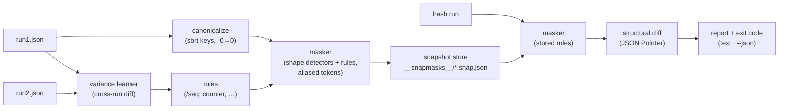

# snapmask

[English](README.md) | [中文](README.zh.md) | [日本語](README.ja.md)

[](LICENSE)   [](CONTRIBUTING.md)

**JSON snapshot testing that auto-detects and masks timestamps, UUIDs, and counters before diffing — volatility is inferred from value shape and cross-run variance, not from a hand-maintained matcher config.**


```bash
# not yet on npm — install from a checkout of this repository
npm install && npm run build && npm pack
npm install -g ./snapmask-0.1.0.tgz
```

## Why snapmask?

API snapshot tests die the same death everywhere: the first `requestId`, `createdAt` or `seq` field makes every run differ from the last, so someone starts a property-matcher list — `expect.any(String)` here, a regex scrubber there — and that list becomes a config file nobody trusts. It grows with every new endpoint, silently over-matches (an `expect.any(String)` on `status` will happily accept `"exploded"`), and still misses the field added last sprint. snapmask attacks the problem from the value side instead of the config side. Formats that are volatile *by construction* — UUIDs, ULIDs, ObjectIds, JWTs, ISO and HTTP timestamps — are recognized from shape alone and masked immediately. Ambiguous shapes — epoch-range integers, hex digests, counters, rotating cursors — are never masked on a guess: you record two runs of the same request, snapmask diffs them, and every field that moved becomes a learned rule stored *inside the snapshot*. Masked ids stay referentially consistent (`<uuid:1>` everywhere the same id appeared), so a snapshot still proves that `items[0].ownerId` is the customer — it just stops caring which random UUID the customer got today. No matcher list, no per-field annotations, nothing to maintain when the payload grows.

| | snapmask | Jest property matchers | hand-rolled scrubbers | plain `toMatchSnapshot` |
|---|---|---|---|---|
| Volatile fields found automatically | ✅ shape + variance | ❌ you list every path | ❌ you regex every format | ❌ |
| Ambiguity handled honestly | ✅ candidates mask only after 2-run proof | ❌ `any(String)` accepts anything | 🟡 depends on regex care | — |
| Masked ids keep referential identity | ✅ `<uuid:1>` aliasing | ❌ | ❌ typically flattened | ❌ |
| Masking config lives with the snapshot | ✅ rules inside the file | ❌ scattered in test code | ❌ helper modules | — |
| Works on raw JSON from any client/language | ✅ CLI + stdin | ❌ Jest only | 🟡 | ❌ test-runner bound |
| Diff pinpoints the change | ✅ JSON Pointer per field | 🟡 blob diff | 🟡 | 🟡 blob diff |
| Runtime dependencies | ✅ zero | ❌ Jest stack | — | ❌ Jest stack |

<sub>Comparison against each tool's public docs and behavior, 2026-07. snapmask deliberately refuses to mask what it cannot prove volatile: an epoch-looking integer stays unmasked until cross-run variance confirms it, and structural differences between runs are reported as warnings instead of being hidden. See [docs/detection.md](docs/detection.md) for exact semantics.</sub>

## Features

- **Shape detection with receipts** — UUIDs (v1–v8), ULIDs, MongoDB ObjectIds, JWTs, ISO 8601 date-times and HTTP dates are masked on sight; bare dates like `2019-03-01` are left alone, because a birthday is data, not noise.
- **Two-tier confidence, no silent over-masking** — epoch integers, hex digests and durations are only *candidates*; `mask --explain` lists them, and they mask solely after variance proves they move or you add a manual rule.
- **Cross-run variance learning** — `snap run1.json run2.json` diffs the runs and turns every moving field into a rule (`/items/*/seq: counter`), with array indices generalized to `*`; structural differences become warnings, never rules.
- **Referential aliasing** — equal source values share a token (`<uuid:1>`), so cross-references between masked ids are still asserted; a response where `ownerId` suddenly points at a different entity fails even though both values are valid UUIDs.
- **Rules travel with the snapshot** — each `*.snap.json` carries its masked document *and* its learned rules with provenance (`shape` / `variance` / `manual`), so `check` reproduces the exact recorded masking with no external config to drift.
- **Zero runtime dependencies, fully offline** — detectors, learner, differ and CLI are all in-repo; Node.js is the only requirement, `typescript` the sole devDependency, exit codes 0/1/2 and `--json` for CI, stdin for pipes.

## Quickstart

Capture the same request twice (any HTTP client works — snapmask only reads JSON):

```bash
curl -s http://127.0.0.1:8080/api/orders > run1.json
curl -s http://127.0.0.1:8080/api/orders > run2.json
snapmask snap run1.json run2.json --name orders
```

```text
✓ orders → __snapmasks__/orders.snap.json (written)
  9 fields masked (5 shape · 4 variance), 4 rules learned from 2 runs
```

The five shape masks are the UUIDs and the timestamp; the four learned rules are the fields that moved between the runs: `/seq` (counter), `/etag` (hex-digest), `/tookMs` (counter) and `/pagination/cursor` (token). In CI, every fresh run is checked against the stored masked document — volatile churn passes, real changes fail with the exact pointer (real captured output):

```text
✗ orders — 2 differences after masking
  ~ /items/0/qty: 2 → 3
  ~ /total: 2980 → 4230
accept with: snapmask check --update (or re-record with snapmask snap)
```

Intended? `snapmask check --update` accepts the new payload and the snapshot diff goes into the same commit as the API change. The full worked example — including the committed snapshot with its learned rules — lives in [examples/](examples/README.md).

## Commands

| Command | Does | Key options |
|---|---|---|
| `snap <runs…>` | record a snapshot; extra runs feed variance learning | `--name`, `--dir` |
| `check <run>` | mask a fresh run with stored rules, diff, fail on drift | `--update`, `--json` |
| `mask <run>` | print the masked document (pipe filter) | `--name`, `--explain` |
| `learn <runs…>` | infer rules from 2+ runs and print them | `--json` |
| `ls` | list snapshots with rule provenance | `--dir` |

Inputs are JSON files or `-` for stdin; snapshots live in `__snapmasks__/` (or `--dir`). Exit codes: `0` clean, `1` mismatch, `2` usage or input error.

## What gets masked

| Kind | Example | Tier |
|---|---|---|
| `uuid`, `ulid`, `objectid` | `a3bb189e-…`, `01ARZ3ND…`, 24-hex | masked on shape |
| `jwt` | `eyJ…`​`.eyJ…`​`.sig` | masked on shape |
| `timestamp-iso`, `timestamp-http` | `2026-07-13T08:15:30Z`, `Sun, 13 Jul 2026 … GMT` | masked on shape |
| `epoch-seconds`, `epoch-millis` | `1752394530` | candidate — needs variance |
| `hex-digest`, `duration` | `9e107d9d…` (32/40/64/128 hex), `12ms` | candidate — needs variance |
| `counter`, `number`, `token`, `value` | anything observed moving across runs | learned from variance |

Key order never matters (documents are canonicalized before masking and diffing), array order always does, and a structural difference between learning runs — a key present in one run only, arrays of different lengths — is a printed warning, because masking cannot make two different shapes equal.

## Architecture



## Roadmap

- [x] Shape detectors with confidence tiers, cross-run variance learning, referential token aliasing, canonical snapshot store, pointer-level diff, snap/check/mask/learn/ls CLI, 89 tests + smoke script (v0.1.0)
- [ ] Manual rule editing via CLI (`snapmask rule add /path kind`)
- [ ] Ignore-subtree rules (`kind: ignored`) for fields that should not even be compared
- [ ] Sequence-aware counters: assert monotonicity instead of masking the value entirely
- [ ] Multi-document learning from a directory of captures
- [ ] First-class test-runner adapters (node:test, Vitest, Jest) over the library API
- [ ] Publish to npm

See the [open issues](https://github.com/JaydenCJ/snapmask/issues) for the full list.

## Contributing

Contributions are welcome. Build with `npm install && npm run build`, then run `npm test` and `bash scripts/smoke.sh` (must print `SMOKE OK`) — this repository ships no CI, every claim above is verified by local runs. See [CONTRIBUTING.md](CONTRIBUTING.md), grab a [good first issue](https://github.com/JaydenCJ/snapmask/issues?q=is%3Aissue+is%3Aopen+label%3A%22good+first+issue%22), or start a [discussion](https://github.com/JaydenCJ/snapmask/discussions).

## License

[MIT](LICENSE)
