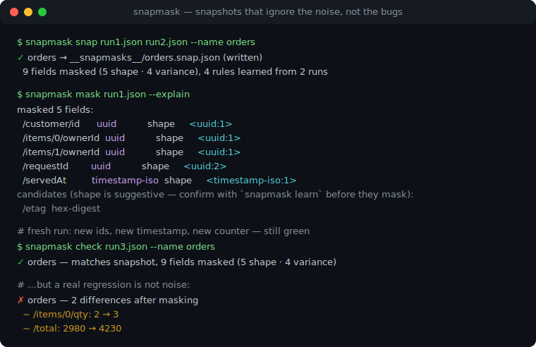
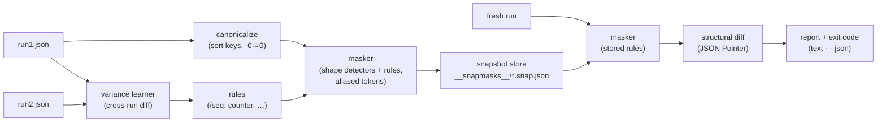

# snapmask

[English](README.md) | [中文](README.zh.md) | [日本語](README.ja.md)

[](LICENSE)   [](CONTRIBUTING.md)

**JSON 快照测试工具：在 diff 之前自动检测并掩码时间戳、UUID 和计数器——易变性由值的形状与跨运行差异推断得出，而非手工维护的 matcher 配置。**



```bash
# not yet on npm — install from a checkout of this repository
npm install && npm run build && npm pack
npm install -g ./snapmask-0.1.0.tgz
```

## 为什么选 snapmask？

API 快照测试在哪儿都死于同一种病：第一个 `requestId`、`createdAt` 或 `seq` 字段让每次运行都与上次不同，于是有人开始维护 property-matcher 清单——这里一个 `expect.any(String)`，那里一个正则清洗器——这份清单最终变成谁都不信任的配置文件。它随每个新端点膨胀、悄悄过度匹配（`status` 上的 `expect.any(String)` 会欣然接受 `"exploded"`），却仍会漏掉上个迭代新增的字段。snapmask 从值这一侧、而不是配置那一侧解决问题。那些*天生*易变的格式——UUID、ULID、ObjectId、JWT、ISO 与 HTTP 时间戳——仅凭形状即可识别并立即掩码。而有歧义的形状——epoch 区间的整数、hex 摘要、计数器、轮换游标——绝不靠猜测掩码：你把同一请求录制两次，snapmask 对比两次运行，每个发生变动的字段都变成一条学习规则，直接存进*快照文件内部*。被掩码的 id 保持引用一致（同一 id 出现处一律 `<uuid:1>`），因此快照仍能证明 `items[0].ownerId` 就是那位客户——只是不再关心客户今天拿到的是哪个随机 UUID。没有 matcher 清单，没有逐字段注解，payload 增长时无需维护任何东西。

| | snapmask | Jest property matchers | 手写清洗器 | 裸 `toMatchSnapshot` |
|---|---|---|---|---|
| 自动发现易变字段 | ✅ 形状 + 跨运行差异 | ❌ 每条路径都要列 | ❌ 每种格式都要写正则 | ❌ |
| 诚实处理歧义 | ✅ 候选需两次运行证明才掩码 | ❌ `any(String)` 什么都接受 | 🟡 取决于正则功力 | — |
| 掩码后的 id 保留引用身份 | ✅ `<uuid:1>` 别名 | ❌ | ❌ 通常被抹平 | ❌ |
| 掩码配置随快照存放 | ✅ 规则在文件内 | ❌ 散落在测试代码里 | ❌ 各种 helper 模块 | — |
| 处理任意客户端/语言产出的原始 JSON | ✅ CLI + stdin | ❌ 仅限 Jest | 🟡 | ❌ 绑定测试框架 |
| diff 精确指出变化位置 | ✅ 逐字段 JSON Pointer | 🟡 整块 diff | 🟡 | 🟡 整块 diff |
| 运行时依赖 | ✅ 零 | ❌ Jest 全家桶 | — | ❌ Jest 全家桶 |

<sub>对比基于各工具 2026-07 的公开文档与行为。snapmask 刻意拒绝掩码它无法证明易变的东西：看起来像 epoch 的整数在跨运行差异确认之前保持原样，运行之间的结构性差异会作为警告报告而不是被藏起来。精确语义见 [docs/detection.md](docs/detection.md)。</sub>

## 特性

- **有凭有据的形状检测** — UUID（v1–v8）、ULID、MongoDB ObjectId、JWT、ISO 8601 日期时间和 HTTP 日期一经识别立即掩码；`2019-03-01` 这样的纯日期不动，因为生日是数据，不是噪音。
- **双层置信度，绝不悄悄过度掩码** — epoch 整数、hex 摘要和时长只是*候选*；`mask --explain` 会列出它们，只有差异证明其变动、或你添加手工规则后才会掩码。
- **跨运行差异学习** — `snap run1.json run2.json` 对比两次运行，把每个变动字段变成规则（`/items/*/seq: counter`），数组下标泛化为 `*`；结构性差异变成警告，永远不会变成规则。
- **引用别名** — 相同源值共享同一 token（`<uuid:1>`），被掩码 id 之间的交叉引用仍被断言；`ownerId` 突然指向另一个实体的响应会失败，哪怕两个值都是合法 UUID。
- **规则随快照走** — 每个 `*.snap.json` 同时携带掩码后的文档*和*带来源标注的学习规则（`shape` / `variance` / `manual`），`check` 精确复现录制时的掩码，没有会漂移的外部配置。
- **零运行时依赖，完全离线** — 检测器、学习器、differ 和 CLI 全部在仓库内实现；只需要 Node.js，`typescript` 是唯一 devDependency，退出码 0/1/2 加 `--json` 服务 CI，stdin 支持管道。

## 快速上手

把同一个请求录制两次（任何 HTTP 客户端都行——snapmask 只读 JSON）：

```bash
curl -s http://127.0.0.1:8080/api/orders > run1.json
curl -s http://127.0.0.1:8080/api/orders > run2.json
snapmask snap run1.json run2.json --name orders
```

```text
✓ orders → __snapmasks__/orders.snap.json (written)
  9 fields masked (5 shape · 4 variance), 4 rules learned from 2 runs
```

5 个形状掩码是那些 UUID 和时间戳；4 条学习规则是两次运行之间变动的字段：`/seq`（counter）、`/etag`（hex-digest）、`/tookMs`（counter）和 `/pagination/cursor`（token）。在 CI 里，每次新的运行都对照存储的掩码文档检查——易变噪音直接通过，真实变化带着精确指针失败（真实捕获输出）：

```text
✗ orders — 2 differences after masking
  ~ /items/0/qty: 2 → 3
  ~ /total: 2980 → 4230
accept with: snapmask check --update (or re-record with snapmask snap)
```

是有意的改动？`snapmask check --update` 接受新 payload，快照 diff 和 API 改动进同一个 commit。完整的可运行示例——包括携带学习规则的已提交快照——在 [examples/](examples/README.md)。

## 命令

| 命令 | 作用 | 关键选项 |
|---|---|---|
| `snap <runs…>` | 录制快照；额外的运行文件供差异学习 | `--name`、`--dir` |
| `check <run>` | 用存储的规则掩码新运行、diff、漂移即失败 | `--update`、`--json` |
| `mask <run>` | 打印掩码后的文档（管道过滤器） | `--name`、`--explain` |
| `learn <runs…>` | 从 2+ 次运行推断规则并打印 | `--json` |
| `ls` | 列出快照及规则来源 | `--dir` |

输入是 JSON 文件或 `-`（stdin）；快照放在 `__snapmasks__/`（或 `--dir`）。退出码：`0` 通过，`1` 不匹配，`2` 用法或输入错误。

## 什么会被掩码

| 类别 | 示例 | 层级 |
|---|---|---|
| `uuid`、`ulid`、`objectid` | `a3bb189e-…`、`01ARZ3ND…`、24 位 hex | 凭形状掩码 |
| `jwt` | `eyJ…`​`.eyJ…`​`.sig` | 凭形状掩码 |
| `timestamp-iso`、`timestamp-http` | `2026-07-13T08:15:30Z`、`Sun, 13 Jul 2026 … GMT` | 凭形状掩码 |
| `epoch-seconds`、`epoch-millis` | `1752394530` | 候选——需差异确认 |
| `hex-digest`、`duration` | `9e107d9d…`（32/40/64/128 位 hex）、`12ms` | 候选——需差异确认 |
| `counter`、`number`、`token`、`value` | 任何被观察到跨运行变动的值 | 从差异学习 |

键顺序从不影响结果（文档在掩码与 diff 前会规范化），数组顺序永远算数；学习运行之间的结构性差异——只在一次运行中出现的键、长度不同的数组——会打印警告，因为掩码无法让两个不同的形状相等。

## 架构



## 路线图

- [x] 带置信度层级的形状检测器、跨运行差异学习、引用 token 别名、规范化快照存储、指针级 diff、snap/check/mask/learn/ls CLI、89 个测试 + smoke 脚本（v0.1.0）
- [ ] 通过 CLI 手工编辑规则（`snapmask rule add /path kind`）
- [ ] 忽略子树规则（`kind: ignored`），彻底跳过不该比较的字段
- [ ] 感知序列的计数器：断言单调性而不是整个掩掉
- [ ] 从一个目录的多份捕获做多文档学习
- [ ] 基于库 API 的一等测试框架适配器（node:test、Vitest、Jest）
- [ ] 发布到 npm

完整列表见 [open issues](https://github.com/JaydenCJ/snapmask/issues)。

## 参与贡献

欢迎贡献。用 `npm install && npm run build` 构建，然后运行 `npm test` 和 `bash scripts/smoke.sh`（必须打印 `SMOKE OK`）——本仓库不带 CI，以上每一条声明都由本地运行验证。参见 [CONTRIBUTING.md](CONTRIBUTING.md)，认领一个 [good first issue](https://github.com/JaydenCJ/snapmask/issues?q=is%3Aissue+is%3Aopen+label%3A%22good+first+issue%22)，或发起一个 [discussion](https://github.com/JaydenCJ/snapmask/discussions)。

## 许可证

[MIT](LICENSE)
